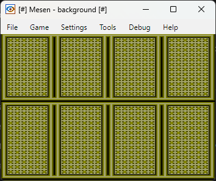

# Load background

This code demonstrates, how to design and load background. This is assembled with ca65 and linked with ld65 from the cc65 suite.

Use below make commands.
```bash
# Clean directory
make clean

# Make ROM (Rom will be placed in build directory)
make

# Generate nl file to use debug symbols with FCEUX emulator
make sym
```

By default make will generate `.map` and `.dbg` files. Mesen emulator uses `.dbg` file for debug symbols, use `make sym` command to generate `.nl` file for debug symbols for FCEUX emulator.


## Details

### 1. Design CHR file
I have designed 8KB CHR data file (kaboom.chr) in `YY-CHR` tool. First 4KB contains tiles for sprites and second 4KB contains tiles for background.


### 2. Design Nametable
Name contains tile arrangement details for background. I have created nametable file in `Nes Screen Tool`. Open previously created CHR file and design name table, NesScreenTool will save 3 file with extensions:
- kaboom.nam (Name Table File)
- - This file contains 1024 bytes of data. First 960 bytes for respective screen tile and last 64 bytes for attribute data.
- kaboom.msb (Meta Sprite Table File)
- kaboom.pal (Name Table File)
- - This is 16 bytes file containing palette details.

> In this demo, I have only used .nam and .pal files. I have created 2 .pal files with different palette information for sprites and background (`kaboom_sprite.pal` and `kaboom.pal`).


## Code - Change
I have added a separate routine called `LoadGraphics` in `LoadGraphics.s` file and exported it. This module imported in `background.s` file and used. 
```
JSR LoadGraphics
```

> This should be loaded once before game logic thus should not be placed in game loop.

## Code - Flow
1. Disable rendering
2. Reset address latch
3. Set palette address (#$3F10 Palette location in [PPU_memory_map](https://www.nesdev.org/wiki/PPU_memory_map)) 
4. Load palette

5. Disable rendering
6. Reset address latch
7. Set background address (#$2000 nametable 0 location in [PPU_memory_map](https://www.nesdev.org/wiki/PPU_memory_map)) 
8. Load background

> Disabling rendering is very important else it'll mess up data load and you may get unexpected results.

## Final Result
